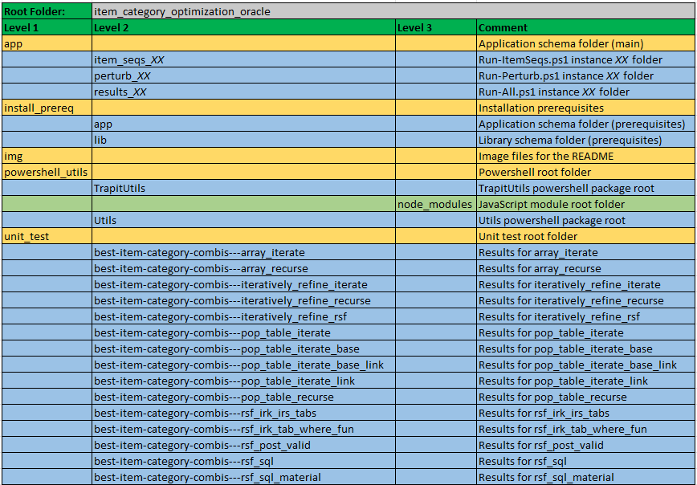

# Optimization Problems with Items and Categories in Oracle
<br />

This project has the code for a series of eight blog articles on `Optimization Problems with Items and Categories in Oracle`. The articles aim to provide a more formal treatment of algorithms for such problems than earlier articles by the author, together with practical implementations, examples and verification techniques in SQL and PL/SQL.

#### List of Articles
- [OPICO 1: Algorithms for Item Sequence Generation](https://brenpatf.github.io/2024/06/30/opico-1_algorithms-for-generation.html)
- [OPICO 2: SQL for Item Sequence Generation](https://brenpatf.github.io/2024/07/07/opico-2_sql_solutions_for_generation.html)
- [OPICO 3: Algorithms for Item/Category Optimization](https://brenpatf.github.io/2024/07/14/opico-3_algorithms_for_itemcategory_optimization.html)
- [OPICO 4: Recursive SQL for Item/Category Optimization](https://brenpatf.github.io/2024/07/21/opico-4_sql_for_itemcategory_optimization.html)
- [OPICO 5: Tuning Recursive SQL for Item/Category Optimization](https://brenpatf.github.io/2024/07/28/opico-5_tuning_sql_for_itemcategory_optimization.html)
- [OPICO 6: Mixed SQL and PL/SQL Methods for Item/Category Optimization](https://brenpatf.github.io/2024/08/04/opico-6_mixed_sql_plsql_for_itemcategory_optimization.html)
- [OPICO 7: Verification](https://brenpatf.github.io/2024/08/11/opico-7_verification.html)
- [OPICO 8: Automation](https://brenpatf.github.io/2024/08/18/opico-8_automation.html)

#### Twitter <br />
- [Thread with Short Recordings](https://x.com/BrenPatF/status/1807642673748033675)

<br />
[Image by <a href="https://pixabay.com/users/aviavlad-9412685/?utm_source=link-attribution&utm_medium=referral&utm_campaign=image&utm_content=8206673">Владимир</a> from <a href="https://pixabay.com//?utm_source=link-attribution&utm_medium=referral&utm_campaign=image&utm_content=8206673">Pixabay</a>]

# In this README...
[&darr; Background](#background)<br />
[&darr; Installation](#installation)<br />
[&darr; Running the Solution Method Scripts](#running-the-solution-method-scripts)<br />
[&darr; Running the Unit Tests](#running-the-unit-tests)<br />
[&darr; Folder Structure](#folder-structure)<br />
[&darr; See Also](#see-also)<br />

## Background
[&uarr; In this README...](#in-this-readme)<br />

<blockquote>The knapsack problem is a problem in combinatorial optimization: Given a set of items, each with a weight and a value, determine the number of each item to include in a collection so that the total weight is less than or equal to a given limit and the total value is as large as possible.</blockquote>

- [Knapsack problem](https://en.wikipedia.org/wiki/Knapsack_problem)

The knapsack problem and many other problems in combinatorial optimization require the selection of a subset of items to maximize an objective function subject to constraints. A common approach to solving these problems algorithmically involves recursively generating sequences of items of increasing length in a search for the best subset that meets the constraints.

I applied this kind of approach using SQL for a number of problems, starting in January 2013 with [A Simple SQL Solution for the Knapsack Problem (SKP-1)](https://aprogrammerwrites.eu/?p=560), and I wrote a summary article, [Knapsacks and Networks in SQL](https://aprogrammerwrites.eu/?p=2232), in December 2017 when I put the code onto GitHub, [sql_demos - Brendan's repo for interesting SQL](https://github.com/BrenPatF/sql_demos).

The latest series of articles takes a broader and deeper approach to the problems covered, including mathematics, verification techniques and automation, with a variety of algorithms and implementations.

## Installation
[&uarr; In this README...](#in-this-readme)<br />
[&darr; Prerequisite Applications](#prerequisite-applications)<br />
[&darr; Clone Git Repository](#clone-git-repository)<br />
[&darr; Oracle Installs](#oracle-installs)<br />
[&darr; Powershell and JavaScript Packages](#powershell-and-javascript-packages)<br />

### Prerequisite Applications
[&uarr; Installation](#installation)<br />
[&darr; Github Desktop](#github-desktop)<br />
[&darr; Oracle](#oracle)<br />
[&darr; Node.js](#nodejs)<br />
[&darr; Powershell](#powershell)<br />

#### Github Desktop
[&uarr; Prerequisite Applications](#prerequisite-applications)<br />
In order to clone the code as a git repository you need to have the git application installed. I recommend [Github Desktop](https://desktop.github.com/) UI for managing repositories on windows. This depends on the git application, available here: [git downloads](https://git-scm.com/downloads), but can also be installed from within Github Desktop, according to these instructions:
[How to install GitHub Desktop](https://www.techrepublic.com/article/how-to-install-github-desktop/).

#### Oracle
[&uarr; Prerequisite Applications](#prerequisite-applications)<br />

An Oracle client is required, including sqlplus, with access to an Oracle database:

- [Oracle Instant Client Downloads for Microsoft Windows (x64) 64-bit](https://www.oracle.com/ie/database/technologies/instant-client/winx64-64-downloads.html)

You can download the Oracle database here:

[Oracle Database Software Downloads](https://www.oracle.com/database/technologies/oracle-database-software-downloads.html).

#### Node.js
[&uarr; Prerequisite Applications](#prerequisite-applications)<br />

The unit test results are formatted using a JavaScript program, which is included as part of the current project. Running the program requires the Node.js application:

- [Node.js Downloads](https://nodejs.org/en/download)

#### Powershell
[&uarr; Prerequisite Applications](#prerequisite-applications)<br />

Powershell is optional, and is used in the project for automation purposes, and for generating a template for the JSON input file required by [The Math Function Unit Testing Design Pattern](https://brenpatf.github.io/2023/06/05/the-math-function-unit-testing-design-pattern.html):

- [Installing Windows PowerShell](https://learn.microsoft.com/en-us/powershell/scripting/windows-powershell/install/installing-windows-powershell)

### Clone Git Repository
[&uarr; Installation](#installation)<br />

The following steps will download the repository into a folder, item_category_optimization_oracle, within your GitHub root folder:
- Open Github desktop and click [File/Clone repository...]
- Paste into the url field on the URL tab: https://github.com/BrenPatF/item_category_optimization_oracle.git
- Choose local path as folder where you want your GitHub root to be
- Click [Clone]

### Oracle Installs
[&uarr; Installation](#installation)<br />
[&darr; Automated Installation](#automated-installation)<br />
[&darr; Manual Installation](#manual-installation)<br />

The Oracle installation can be performed via a single powershell script, or in a series of smaller steps.

#### Automated Installation
[&uarr; Oracle Installs](#oracle-installs)<br />

The Oracle installation can be performed simply by running the following powershell script, `Install-Ico.ps1`:

##### [Folder: (module root)]

```powershell
.\Install-Ico
```

Some points to note:
- This script copies two files to a folder "c:/input", creating it if it does not exist, and aborting if it exists as a file
- This script tries to create lib and app schemas using sys schema, with all passwords assumed to be the  usernames, and TNS alias orclpdb
- There is a script drop_utils_users.sql that can be run manually first to drop those schemas if they exist, and is included in the powershell script

##### [Schema: sys; Folder: install_prereq] Drop lib and app schemas

```sql
SQL> @drop_utils_users
```

#### Manual Installation
[&uarr; Oracle Installs](#oracle-installs)<br />
[&darr; File System Installs](#file-system-installs)<br />
[&darr; Database Installs](#database-installs)<br />

##### File System Installs
[&uarr; Manual Installation](#manual-installation)<br />

- Copy the following files to the server folder pointed to by the Oracle directory INPUT_DIR:

    - fantasy_premier_league_player_stats.csv
    - unit_test/tt_item_cat_seqs.purely_wrap_best_combis_inp.json

- There is also a powershell script to do this, assuming C:\input as INPUT_DIR. From a powershell window in the root folder:
```powershell
$ ./Copy-DataFilesInput.ps1
```

##### Database Installs
[&uarr; Manual Installation](#manual-installation)<br />
[&darr; Install prerequisite modules](#install-prerequisite-modules)<br />
[&darr; Install main module](#install-main-module)<br />

The Oracle database installation is implemented through a small number of driver scripts: One per Oracle schema and folder, separating out the prerequisite installs from the main ones, and base from unit test components.

| Script               | Schema | Folder             | Purpose                                         |
|:---------------------|:-------|:-------------------|:------------------------------------------------|
| drop_utils_users.sql | sys    | install_prereq     | Drop lib and app schemas and Oracle directory   |
| install_sys.sql      | sys    | install_prereq     | Create lib and app schemas and Oracle directory |
| install_lib_all.sql  | lib    | install_prereq\lib | Install lib components                          |
| c_syns_all.sql       | app    | install_prereq\app | Create app synonyms to lib                      |
| install_ico.sql      | app    | app                | Install app base components                     |
| install_ico_tt.sql   | app    | app                | Install app unit test components                |

###### Install prerequisite modules
[&uarr; Database Installs](#database-installs)<br />

The install depends on the prerequisite modules Utils, Trapit, Timer_Set, all installed in the `lib` schema. The sys install creates the lib schema for the prerequisites and app for the main code and tables.

The prerequisite modules can be installed by following the instructions for each module at the module root pages listed in the `See Also` section below. This allows inclusion of the examples and unit tests for those modules. Alternatively, the next section shows how to install these modules directly without their examples or unit tests.

###### [Schema: sys; Folder: install_prereq] Create lib and app schemas and Oracle directory
install_sys.sql creates an Oracle directory, `input_dir`, pointing to 'c:\input'. Update this if necessary to a folder on the database server with read/write access for the Oracle OS user
- Run script from slqplus:

```sql
SQL> @install_sys
```

###### [Schema: lib; Folder: install_prereq\lib] Install lib components
- Run script from slqplus:

```sql
SQL> @install_lib_all
```

###### [Schema: app; Folder: install_prereq\app] Create app synonyms to lib
- Run script from slqplus:

```sql
SQL> @c_syns_all
```

###### Install main module
[&uarr; Database Installs](#database-installs)<br />

###### [Schema: app; Folder: app] Install app components

- Run script from slqplus:

```sql
SQL> @install_ico
SQL> @install_ico_tt
```

### Powershell and JavaScript Packages
[&uarr; Installation](#installation)<br />

As noted in the Prerequisite Applications section, JavaScript is used to format unit test results, and Powershell is optionally used for automation purposes, and for generating a template for the JSON input file required by [The Math Function Unit Testing Design Pattern](https://brenpatf.github.io/2023/06/05/the-math-function-unit-testing-design-pattern.html).

Both JavaScript and Powershell packages have their own GitHub projects:

- [Trapit - JavaScript Unit Tester/Formatter](https://github.com/BrenPatF/trapit_nodejs_tester)
- [Powershell utilities module](https://github.com/BrenPatF/powershell_utils)

However, for convenience the packages are included in the current project folder structure, rooted in the powershell_utils subfolder, and do not require separate installation.

There are two main entry points in the Powershell module, listed below:

- Format-JSON-Ico.ps1<br />
This is used to generate a template input JSON file for the `Optimization Problems with Items and Categories in Oracle` module.

- Test-Format-Ico.ps1<br />
This runs Oracle unit tests for a given test group ('item_cat_seqs' here) for the `Optimization Problems with Items and Categories in Oracle` module, and includes the formatting step by means of a call to the JavaScript formatter. Further details are included in [Running the Unit Tests](#running-the-unit-tests) below.

More information can be found in the seventh article in the associated blog series, [OPICO 1-8: Optimization Problems with Items and Categories in Oracle](#list-of-articles), on `Verification`.

## Running the Solution Method Scripts
[&uarr; In this README...](#in-this-readme)<br />
[&darr; Running for Various Sets of Filtering Parameter Values](#running-for-various-sets-of-filtering-parameter-values)<br />
[&darr; Running the Perturbation Analysis](#running-the-perturbation-analysis)<br />
[&darr; Running the Sequence Generation Scripts](#running-the-sequence-generation-scripts)<br />

### Running for Various Sets of Filtering Parameter Values
[&uarr; Running the Solution Method Scripts](#running-the-solution-method-scripts)<br />

#### [Schema: app; Folder: app] Run-All.ps1

There is a powershell script Run-All.ps1 that runs the sqlplus scripts for the different solution methods for the optimization problem, with various combinations of parameters for each of three datasets, as discussed in the associated blog articles.

It also runs a script to generate all possible sequences for different types of sequence for the small dataset only, using several solution methods.

<div style="overflow-y: auto; max-height: 500px">

```powershell
Date -format "dd-MMM-yy HH:mm:ss"
$startTime = Get-Date

$directories = Get-ChildItem -Directory | Where-Object { $_.Name -match "^results_\d+$" }
[int]$maxIndex = 0
if ($directories.Count -gt 0) {
    [int[]]$indexLis = $directories |
        ForEach-Object {
            $_.Name -replace 'results_', ''
        }
    $maxIndex = ($indexLis | Measure-Object -Maximum).Maximum
}
$nxtIndex = ($maxIndex + 1).ToString("D2")
$newDir = ('results_' + $nxtIndex)
New-Item ('results_' + $nxtIndex) -ItemType Directory

$logFile = $PSScriptRoot + '\Run-All_' + $nxtIndex + '.log'
$ddl = 'c_temp_tables'
$inputs = [ordered]@{
    sml = [ordered]@{views_sml              = @()
                     item_seqs              = @(@('MP'),@('MC'),@('SP'),@('SC'))
                     item_cat_seqs          = @(,@(10, 0))
                     item_cat_seqs_rsf      = @(,@(10, 0))
                     item_cat_seqs_pv_rsf   = @()
                     item_cat_seqs_loop     = @(,@(10, 3))}
    bra = [ordered]@{views_bra              = @()
                     item_cat_seqs          = @(@(10, 0),@(100, 0),@(100, 10748),@(0, 10748))
                     item_cat_seqs_rsf      = @(@(10, 0),@(100, 0),@(100, 10748),@(0, 10748))
                     item_cat_seqs_loop     = @(,@(10, 3))}
    eng = [ordered]@{views_eng              = @()
                     item_cat_seqs          = @(@(50, 0),@(300, 0),@(300, 1952),@(0, 1952))
                     item_cat_seqs_rsf      = @(@(50, 0),@(300, 0),@(300, 1952),@(0, 1952))
                     item_cat_seqs_loop     = @(,@(50, 3))}
}

foreach($i in $inputs.Keys){
    Set-Location $newDir
    $i
    [string]$cmdLis = ('@..\' + $ddl + [Environment]::NewLine)
    $logLis = @()
    foreach($v in $inputs[$i]) {
        foreach($k in $v.Keys) {
            if($v[$k].length -eq 0) {
                $cmdLis += ('@..\' + $k + [Environment]::NewLine)
            }
            foreach($p in $v[$k]) {
                $newCmd = ('@..\' + $k + ' ' + $i + ' ' + $p[0] + ' ' + $p[1])
                ("newCmd = " + $newCmd)
                $p
                $cmdLis += ($newCmd + [Environment]::NewLine)
                if($p[1] -ne $null) {$logLis += ($k + '_' + $i + '_' + $p[0] + '_' + $p[1] + '.log')}
            }
        }
    }
    $cmdLis
    $output = $cmdLis | sqlplus 'app/app@orclpdb'
    Set-Location ..

    foreach($l in $logLis) {
        $f = $newDir + '\' + $l
        $l | Out-File $logFile -Append -encoding utf8
        Get-Content $f | Select-String -Pattern 'Timer Set: Item_Cat_Seqs,' -Context 0, 17 | Out-File $logFile -Append -encoding utf8
        Get-Content $f | Select-String -Pattern 'Timer Set: Item_Cat_Seqs_RSF' -Context 0, 14 | Out-File $logFile -Append -encoding utf8
        Get-Content $f | Select-String -Pattern 'Timer Set: Item_Cat_Seqs_Loop' -Context 0, 12 | Out-File $logFile -Append -encoding utf8
    }
}
$elapsedTime = (Get-Date) - $startTime
$roundedTime = [math]::Round($elapsedTime.TotalSeconds)

"Total time taken: $roundedTime seconds" | Out-File $logFile -Append -encoding utf8

```
</div>

It creates a summary log file, Run-All_xx.log and a subfolder, results_xx, with the detailed log files, where xx is a 2 digit integer 1 greater than the previous run. Here is an example of the summary log file:

<div style="overflow-y: auto; max-height: 500px">

```
item_cat_seqs_sml_10_0.log

> Timer Set: Item_Cat_Seqs, Constructed at 10 Jun 2024 23:37:03, written at 23:37:04
  ==================================================================================
  Timer                                   Elapsed         CPU       Calls       Ela/Call       CPU/Call
  -----------------------------------  ----------  ----------  ----------  -------------  -------------
  Pop_Table_Iterate                          0.17        0.16           1        0.16800        0.16000
  Solutions by Category                      0.03        0.02           1        0.03400        0.02000
  Pop_Table_Iterate_Base                     0.19        0.14           1        0.18800        0.14000
  Pop_Table_Iterate_Link                     0.24        0.17           1        0.24100        0.17000
  Pop_Table_Iterate_Link - item level        0.03        0.01           1        0.03200        0.01000
  Pop_Table_Iterate_Base_Link                0.21        0.19           1        0.20600        0.19000
  Array_Iterate                              0.12        0.10           1        0.12300        0.10000
  Pop_Table_Recurse                          0.11        0.10           1        0.11200        0.10000
  Array_Recurse                              0.13        0.10           1        0.13000        0.10000
  (Other)                                    0.00        0.00           1        0.00300        0.00000
  -----------------------------------  ----------  ----------  ----------  -------------  -------------
  Total                                      1.24        0.99          10        0.12370        0.09900
  -----------------------------------  ----------  ----------  ----------  -------------  -------------
  [Timer timed (per call in ms): Elapsed: 0.00990, CPU: 0.00792]


item_cat_seqs_rsf_sml_10_0.log

> Timer Set: Item_Cat_Seqs_RSF, Constructed at 10 Jun 2024 23:37:04, written at 23:37:06
  ======================================================================================
  Timer                          Elapsed         CPU       Calls       Ela/Call       CPU/Call
  --------------------------  ----------  ----------  ----------  -------------  -------------
  rsf_sql_v                         0.03        0.01           1        0.02900        0.01000
  rsf_sql_material_v                0.03        0.04           1        0.02700        0.04000
  Item_Cat_Seqs.Init                0.01        0.01           3        0.00433        0.00333
  rsf_irk_irs_tabs_v                0.02        0.03           1        0.02200        0.03000
  rsf_irk_tab_where_fun_ts_v        0.12        0.09           1        0.11800        0.09000
  rsf_irk_tab_where_fun_v           0.02        0.00           1        0.01500        0.00000
  (Other)                           1.32        1.23           1        1.32200        1.23000
  --------------------------  ----------  ----------  ----------  -------------  -------------
  Total                             1.55        1.41           9        0.17178        0.15667
  --------------------------  ----------  ----------  ----------  -------------  -------------
  [Timer timed (per call in ms): Elapsed: 0.00962, CPU: 0.00962]


item_cat_seqs_loop_sml_10_3.log

> Timer Set: Item_Cat_Seqs_Loop, Constructed at 10 Jun 2024 23:37:06, written at 23:37:08
  =======================================================================================
  Timer                                       Elapsed         CPU       Calls       Ela/Call       CPU/Call
  ---------------------------------------  ----------  ----------  ----------  -------------  -------------
  Iteratively_Refine_Recurse - path level        0.33        0.31           1        0.32900        0.31000
  Iteratively_Refine_Recurse - item level        0.32        0.32           1        0.32100        0.32000
  Iteratively_Refine_Iterate - path level        0.32        0.28           1        0.31500        0.28000
  Iteratively_Refine_RSF - path level            0.36        0.33           1        0.36300        0.33000
  (Other)                                        0.00        0.00           1        0.00100        0.00000
  ---------------------------------------  ----------  ----------  ----------  -------------  -------------
  Total                                          1.33        1.24           5        0.26580        0.24800
  ---------------------------------------  ----------  ----------  ----------  -------------  -------------
  [Timer timed (per call in ms): Elapsed: 0.00934, CPU: 0.00849]


item_cat_seqs_bra_10_0.log

> Timer Set: Item_Cat_Seqs, Constructed at 10 Jun 2024 23:37:09, written at 23:37:12
  ==================================================================================
  Timer                                   Elapsed         CPU       Calls       Ela/Call       CPU/Call
  -----------------------------------  ----------  ----------  ----------  -------------  -------------
  Pop_Table_Iterate                          0.44        0.37           1        0.44100        0.37000
  Solutions by Category                      0.02        0.01           1        0.02000        0.01000
  Pop_Table_Iterate_Base                     0.41        0.41           1        0.40500        0.41000
  Pop_Table_Iterate_Link                     0.42        0.41           1        0.41700        0.41000
  Pop_Table_Iterate_Link - item level        0.02        0.00           1        0.02100        0.00000
  Pop_Table_Iterate_Base_Link                0.42        0.38           1        0.42000        0.38000
  Array_Iterate                              0.39        0.37           1        0.38800        0.37000
  Pop_Table_Recurse                          0.36        0.35           1        0.35800        0.35000
  Array_Recurse                              0.39        0.36           1        0.38600        0.36000
  (Other)                                    0.00        0.00           1        0.00100        0.00000
  -----------------------------------  ----------  ----------  ----------  -------------  -------------
  Total                                      2.86        2.66          10        0.28570        0.26600
  -----------------------------------  ----------  ----------  ----------  -------------  -------------
  [Timer timed (per call in ms): Elapsed: 0.00909, CPU: 0.00636]


item_cat_seqs_bra_100_0.log

> Timer Set: Item_Cat_Seqs, Constructed at 10 Jun 2024 23:37:12, written at 23:37:16
  ==================================================================================
  Timer                                   Elapsed         CPU       Calls       Ela/Call       CPU/Call
  -----------------------------------  ----------  ----------  ----------  -------------  -------------
  Pop_Table_Iterate                          0.59        0.52           1        0.59200        0.52000
  Solutions by Category                      0.01        0.00           1        0.00700        0.00000
  Pop_Table_Iterate_Base                     0.55        0.51           1        0.55400        0.51000
  Pop_Table_Iterate_Link                     0.55        0.54           1        0.55100        0.54000
  Pop_Table_Iterate_Link - item level        0.01        0.00           1        0.01300        0.00000
  Pop_Table_Iterate_Base_Link                0.51        0.49           1        0.51000        0.49000
  Array_Iterate                              0.62        0.58           1        0.61800        0.58000
  Pop_Table_Recurse                          0.56        0.53           1        0.56300        0.53000
  Array_Recurse                              0.61        0.59           1        0.61300        0.59000
  (Other)                                    0.00        0.01           1        0.00100        0.01000
  -----------------------------------  ----------  ----------  ----------  -------------  -------------
  Total                                      4.02        3.77          10        0.40220        0.37700
  -----------------------------------  ----------  ----------  ----------  -------------  -------------
  [Timer timed (per call in ms): Elapsed: 0.00877, CPU: 0.00877]


item_cat_seqs_bra_100_10748.log

> Timer Set: Item_Cat_Seqs, Constructed at 10 Jun 2024 23:37:16, written at 23:37:19
  ==================================================================================
  Timer                                   Elapsed         CPU       Calls       Ela/Call       CPU/Call
  -----------------------------------  ----------  ----------  ----------  -------------  -------------
  Pop_Table_Iterate                          0.36        0.36           1        0.35500        0.36000
  Solutions by Category                      0.01        0.00           1        0.00600        0.00000
  Pop_Table_Iterate_Base                     0.35        0.34           1        0.35200        0.34000
  Pop_Table_Iterate_Link                     0.36        0.35           1        0.35900        0.35000
  Pop_Table_Iterate_Link - item level        0.01        0.00           1        0.01100        0.00000
  Pop_Table_Iterate_Base_Link                0.36        0.32           1        0.35900        0.32000
  Array_Iterate                              0.37        0.33           1        0.36600        0.33000
  Pop_Table_Recurse                          0.36        0.36           1        0.35800        0.36000
  Array_Recurse                              0.38        0.31           1        0.38300        0.31000
  (Other)                                    0.00        0.00           1        0.00100        0.00000
  -----------------------------------  ----------  ----------  ----------  -------------  -------------
  Total                                      2.55        2.37          10        0.25500        0.23700
  -----------------------------------  ----------  ----------  ----------  -------------  -------------
  [Timer timed (per call in ms): Elapsed: 0.00980, CPU: 0.00882]


item_cat_seqs_bra_0_10748.log

> Timer Set: Item_Cat_Seqs, Constructed at 10 Jun 2024 23:37:19, written at 23:37:21
  ==================================================================================
  Timer                                   Elapsed         CPU       Calls       Ela/Call       CPU/Call
  -----------------------------------  ----------  ----------  ----------  -------------  -------------
  Pop_Table_Iterate                          0.39        0.37           1        0.39300        0.37000
  Solutions by Category                      0.01        0.00           1        0.00600        0.00000
  Pop_Table_Iterate_Base                     0.39        0.38           1        0.38900        0.38000
  Pop_Table_Iterate_Link                     0.41        0.39           1        0.40500        0.39000
  Pop_Table_Iterate_Link - item level        0.02        0.00           1        0.01500        0.00000
  Pop_Table_Iterate_Base_Link                0.39        0.36           1        0.39300        0.36000
  Array_Iterate                              0.40        0.39           1        0.39900        0.39000
  Pop_Table_Recurse                          0.38        0.36           1        0.38200        0.36000
  Array_Recurse                              0.42        0.40           1        0.41500        0.40000
  (Other)                                    0.00        0.00           1        0.00100        0.00000
  -----------------------------------  ----------  ----------  ----------  -------------  -------------
  Total                                      2.80        2.65          10        0.27980        0.26500
  -----------------------------------  ----------  ----------  ----------  -------------  -------------
  [Timer timed (per call in ms): Elapsed: 0.00917, CPU: 0.00826]


item_cat_seqs_rsf_bra_10_0.log

> Timer Set: Item_Cat_Seqs_RSF, Constructed at 10 Jun 2024 23:37:22, written at 23:37:24
  ======================================================================================
  Timer                          Elapsed         CPU       Calls       Ela/Call       CPU/Call
  --------------------------  ----------  ----------  ----------  -------------  -------------
  rsf_sql_v                         0.69        0.65           1        0.69200        0.65000
  rsf_sql_material_v                0.30        0.26           1        0.29700        0.26000
  Item_Cat_Seqs.Init                0.02        0.01           3        0.00533        0.00333
  rsf_irk_irs_tabs_v                0.11        0.08           1        0.10900        0.08000
  rsf_irk_tab_where_fun_ts_v        0.46        0.41           1        0.46300        0.41000
  rsf_irk_tab_where_fun_v           0.15        0.12           1        0.14700        0.12000
  (Other)                           1.14        1.07           1        1.13500        1.07000
  --------------------------  ----------  ----------  ----------  -------------  -------------
  Total                             2.86        2.60           9        0.31767        0.28889
  --------------------------  ----------  ----------  ----------  -------------  -------------
  [Timer timed (per call in ms): Elapsed: 0.00901, CPU: 0.00901]


item_cat_seqs_rsf_bra_100_0.log

> Timer Set: Item_Cat_Seqs_RSF, Constructed at 10 Jun 2024 23:37:25, written at 23:37:42
  ======================================================================================
  Timer                          Elapsed         CPU       Calls       Ela/Call       CPU/Call
  --------------------------  ----------  ----------  ----------  -------------  -------------
  rsf_sql_v                         6.53        6.31           1        6.52700        6.31000
  rsf_sql_material_v                2.85        2.75           1        2.84500        2.75000
  Item_Cat_Seqs.Init                0.02        0.00           3        0.00533        0.00000
  rsf_irk_irs_tabs_v                1.14        1.10           1        1.14300        1.10000
  rsf_irk_tab_where_fun_ts_v        3.79        3.77           1        3.79200        3.77000
  rsf_irk_tab_where_fun_v           1.60        1.57           1        1.60200        1.57000
  (Other)                           1.14        1.11           1        1.14100        1.11000
  --------------------------  ----------  ----------  ----------  -------------  -------------
  Total                            17.07       16.61           9        1.89622        1.84556
  --------------------------  ----------  ----------  ----------  -------------  -------------
  [Timer timed (per call in ms): Elapsed: 0.00885, CPU: 0.00796]


item_cat_seqs_rsf_bra_100_10748.log

> Timer Set: Item_Cat_Seqs_RSF, Constructed at 10 Jun 2024 23:37:42, written at 23:37:44
  ======================================================================================
  Timer                          Elapsed         CPU       Calls       Ela/Call       CPU/Call
  --------------------------  ----------  ----------  ----------  -------------  -------------
  rsf_sql_v                         0.35        0.32           1        0.34700        0.32000
  rsf_sql_material_v                0.16        0.15           1        0.15900        0.15000
  Item_Cat_Seqs.Init                0.01        0.01           3        0.00433        0.00333
  rsf_irk_irs_tabs_v                0.05        0.02           1        0.05000        0.02000
  rsf_irk_tab_where_fun_ts_v        0.78        0.73           1        0.77600        0.73000
  rsf_irk_tab_where_fun_v           0.17        0.14           1        0.17300        0.14000
  (Other)                           1.14        1.13           1        1.14100        1.13000
  --------------------------  ----------  ----------  ----------  -------------  -------------
  Total                             2.66        2.50           9        0.29544        0.27778
  --------------------------  ----------  ----------  ----------  -------------  -------------
  [Timer timed (per call in ms): Elapsed: 0.00877, CPU: 0.00789]


item_cat_seqs_rsf_bra_0_10748.log

> Timer Set: Item_Cat_Seqs_RSF, Constructed at 10 Jun 2024 23:37:45, written at 23:37:49
  ======================================================================================
  Timer                          Elapsed         CPU       Calls       Ela/Call       CPU/Call
  --------------------------  ----------  ----------  ----------  -------------  -------------
  rsf_sql_v                         0.71        0.68           1        0.70700        0.68000
  rsf_sql_material_v                0.41        0.38           1        0.41400        0.38000
  Item_Cat_Seqs.Init                0.01        0.01           3        0.00467        0.00333
  rsf_irk_irs_tabs_v                0.10        0.10           1        0.10300        0.10000
  rsf_irk_tab_where_fun_ts_v        1.99        1.97           1        1.98700        1.97000
  rsf_irk_tab_where_fun_v           0.46        0.43           1        0.45800        0.43000
  (Other)                           1.16        1.10           1        1.15600        1.10000
  --------------------------  ----------  ----------  ----------  -------------  -------------
  Total                             4.84        4.67           9        0.53767        0.51889
  --------------------------  ----------  ----------  ----------  -------------  -------------
  [Timer timed (per call in ms): Elapsed: 0.00971, CPU: 0.00971]


item_cat_seqs_loop_bra_10_3.log

> Timer Set: Item_Cat_Seqs_Loop, Constructed at 10 Jun 2024 23:37:49, written at 23:37:52
  =======================================================================================
  Timer                                       Elapsed         CPU       Calls       Ela/Call       CPU/Call
  ---------------------------------------  ----------  ----------  ----------  -------------  -------------
  Iteratively_Refine_Recurse - path level        0.82        0.80           1        0.81900        0.80000
  Iteratively_Refine_Recurse - item level        0.81        0.78           1        0.81000        0.78000
  Iteratively_Refine_Iterate - path level        0.78        0.77           1        0.78000        0.77000
  Iteratively_Refine_RSF - path level            0.46        0.42           1        0.45800        0.42000
  (Other)                                        0.00        0.00           1        0.00100        0.00000
  ---------------------------------------  ----------  ----------  ----------  -------------  -------------
  Total                                          2.87        2.77           5        0.57360        0.55400
  ---------------------------------------  ----------  ----------  ----------  -------------  -------------
  [Timer timed (per call in ms): Elapsed: 0.00901, CPU: 0.00811]


item_cat_seqs_eng_50_0.log

> Timer Set: Item_Cat_Seqs, Constructed at 10 Jun 2024 23:37:54, written at 23:38:04
  ==================================================================================
  Timer                                   Elapsed         CPU       Calls       Ela/Call       CPU/Call
  -----------------------------------  ----------  ----------  ----------  -------------  -------------
  Pop_Table_Iterate                          1.46        1.42           1        1.45500        1.42000
  Solutions by Category                      0.02        0.00           1        0.01900        0.00000
  Pop_Table_Iterate_Base                     1.36        1.30           1        1.35600        1.30000
  Pop_Table_Iterate_Link                     1.36        1.32           1        1.35600        1.32000
  Pop_Table_Iterate_Link - item level        0.02        0.01           1        0.02200        0.01000
  Pop_Table_Iterate_Base_Link                1.23        1.15           1        1.23100        1.15000
  Array_Iterate                              1.76        1.72           1        1.76200        1.72000
  Pop_Table_Recurse                          1.40        1.39           1        1.40100        1.39000
  Array_Recurse                              1.73        1.69           1        1.72700        1.69000
  (Other)                                    0.00        0.00           1        0.00100        0.00000
  -----------------------------------  ----------  ----------  ----------  -------------  -------------
  Total                                     10.33       10.00          10        1.03300        1.00000
  -----------------------------------  ----------  ----------  ----------  -------------  -------------
  [Timer timed (per call in ms): Elapsed: 0.00935, CPU: 0.00841]


item_cat_seqs_eng_300_0.log

> Timer Set: Item_Cat_Seqs, Constructed at 10 Jun 2024 23:38:04, written at 23:38:55
  ==================================================================================
  Timer                                   Elapsed         CPU       Calls       Ela/Call       CPU/Call
  -----------------------------------  ----------  ----------  ----------  -------------  -------------
  Pop_Table_Iterate                          7.14        6.50           1        7.13600        6.50000
  Solutions by Category                      0.01        0.00           1        0.00600        0.00000
  Pop_Table_Iterate_Base                     6.55        6.14           1        6.54600        6.14000
  Pop_Table_Iterate_Link                     6.26        5.97           1        6.26300        5.97000
  Pop_Table_Iterate_Link - item level        0.02        0.00           1        0.02100        0.00000
  Pop_Table_Iterate_Base_Link                5.16        5.13           1        5.16300        5.13000
  Array_Iterate                              9.13        8.08           1        9.13200        8.08000
  Pop_Table_Recurse                          7.15        6.37           1        7.14500        6.37000
  Array_Recurse                              8.98        8.14           1        8.98100        8.14000
  (Other)                                    0.00        0.00           1        0.00100        0.00000
  -----------------------------------  ----------  ----------  ----------  -------------  -------------
  Total                                     50.39       46.33          10        5.03940        4.63300
  -----------------------------------  ----------  ----------  ----------  -------------  -------------
  [Timer timed (per call in ms): Elapsed: 0.00935, CPU: 0.00841]


item_cat_seqs_eng_300_1952.log

> Timer Set: Item_Cat_Seqs, Constructed at 10 Jun 2024 23:38:55, written at 23:39:03
  ==================================================================================
  Timer                                   Elapsed         CPU       Calls       Ela/Call       CPU/Call
  -----------------------------------  ----------  ----------  ----------  -------------  -------------
  Pop_Table_Iterate                          1.08        1.04           1        1.07600        1.04000
  Solutions by Category                      0.01        0.00           1        0.00600        0.00000
  Pop_Table_Iterate_Base                     1.07        1.02           1        1.06500        1.02000
  Pop_Table_Iterate_Link                     1.06        1.01           1        1.05600        1.01000
  Pop_Table_Iterate_Link - item level        0.02        0.00           1        0.01500        0.00000
  Pop_Table_Iterate_Base_Link                1.01        0.96           1        1.00800        0.96000
  Array_Iterate                              1.35        1.31           1        1.34500        1.31000
  Pop_Table_Recurse                          1.09        1.05           1        1.09000        1.05000
  Array_Recurse                              1.42        1.41           1        1.42200        1.41000
  (Other)                                    0.00        0.00           1        0.00100        0.00000
  -----------------------------------  ----------  ----------  ----------  -------------  -------------
  Total                                      8.08        7.80          10        0.80840        0.78000
  -----------------------------------  ----------  ----------  ----------  -------------  -------------
  [Timer timed (per call in ms): Elapsed: 0.00943, CPU: 0.00943]


item_cat_seqs_eng_0_1952.log

> Timer Set: Item_Cat_Seqs, Constructed at 10 Jun 2024 23:39:03, written at 23:50:22
  ==================================================================================
  Timer                                   Elapsed         CPU       Calls       Ela/Call       CPU/Call
  -----------------------------------  ----------  ----------  ----------  -------------  -------------
  Pop_Table_Iterate                         80.87       78.89           1       80.87200       78.89000
  Solutions by Category                      0.05        0.03           1        0.04700        0.03000
  Pop_Table_Iterate_Base                    87.28       82.65           1       87.27900       82.65000
  Pop_Table_Iterate_Link                    86.37       84.77           1       86.37100       84.77000
  Pop_Table_Iterate_Link - item level        1.40        1.38           1        1.40300        1.38000
  Pop_Table_Iterate_Base_Link               84.90       83.68           1       84.90300       83.68000
  Array_Iterate                            115.81      112.15           1      115.80500      112.15000
  Pop_Table_Recurse                         82.56       81.07           1       82.55600       81.07000
  Array_Recurse                            139.69      138.17           1      139.69200      138.17000
  (Other)                                    0.00        0.01           1        0.00200        0.01000
  -----------------------------------  ----------  ----------  ----------  -------------  -------------
  Total                                    678.93      662.80          10       67.89300       66.28000
  -----------------------------------  ----------  ----------  ----------  -------------  -------------
  [Timer timed (per call in ms): Elapsed: 0.01099, CPU: 0.00989]


item_cat_seqs_rsf_eng_50_0.log

> Timer Set: Item_Cat_Seqs_RSF, Constructed at 10 Jun 2024 23:50:22, written at 23:55:22
  ======================================================================================
  Timer                          Elapsed         CPU       Calls       Ela/Call       CPU/Call
  --------------------------  ----------  ----------  ----------  -------------  -------------
  rsf_sql_v                       207.53      205.83           1      207.52500      205.83000
  rsf_sql_material_v               51.81       50.81           1       51.80900       50.81000
  Item_Cat_Seqs.Init                0.04        0.03           3        0.01300        0.01000
  rsf_irk_irs_tabs_v                8.91        8.75           1        8.91200        8.75000
  rsf_irk_tab_where_fun_ts_v       19.57       19.38           1       19.56500       19.38000
  rsf_irk_tab_where_fun_v          10.70       10.62           1       10.69800       10.62000
  (Other)                           1.17        1.14           1        1.16600        1.14000
  --------------------------  ----------  ----------  ----------  -------------  -------------
  Total                           299.71      296.56           9       33.30156       32.95111
  --------------------------  ----------  ----------  ----------  -------------  -------------
  [Timer timed (per call in ms): Elapsed: 0.00885, CPU: 0.00796]


item_cat_seqs_rsf_eng_300_0.log

> Timer Set: Item_Cat_Seqs_RSF, Constructed at 10 Jun 2024 23:55:22, written at 00:26:21
  ======================================================================================
  Timer                          Elapsed         CPU       Calls       Ela/Call       CPU/Call
  --------------------------  ----------  ----------  ----------  -------------  -------------
  rsf_sql_v                      1252.52     1234.32           1     1252.52200     1234.32000
  rsf_sql_material_v              318.43      305.14           1      318.42600      305.14000
  Item_Cat_Seqs.Init                0.03        0.00           3        0.01000        0.00000
  rsf_irk_irs_tabs_v               72.18       63.97           1       72.18400       63.97000
  rsf_irk_tab_where_fun_ts_v      132.68      125.39           1      132.67700      125.39000
  rsf_irk_tab_where_fun_v          82.30       75.52           1       82.29500       75.52000
  (Other)                           1.19        1.11           1        1.19400        1.11000
  --------------------------  ----------  ----------  ----------  -------------  -------------
  Total                          1859.33     1805.45           9      206.59200      200.60556
  --------------------------  ----------  ----------  ----------  -------------  -------------
  [Timer timed (per call in ms): Elapsed: 0.00885, CPU: 0.00973]


item_cat_seqs_rsf_eng_300_1952.log

> Timer Set: Item_Cat_Seqs_RSF, Constructed at 11 Jun 2024 00:26:21, written at 00:28:47
  ======================================================================================
  Timer                          Elapsed         CPU       Calls       Ela/Call       CPU/Call
  --------------------------  ----------  ----------  ----------  -------------  -------------
  rsf_sql_v                        79.78       78.63           1       79.78100       78.63000
  rsf_sql_material_v               20.43       19.73           1       20.42900       19.73000
  Item_Cat_Seqs.Init                0.04        0.01           3        0.01200        0.00333
  rsf_irk_irs_tabs_v                3.10        3.04           1        3.09500        3.04000
  rsf_irk_tab_where_fun_ts_v       32.27       32.04           1       32.26900       32.04000
  rsf_irk_tab_where_fun_v           8.31        8.27           1        8.31300        8.27000
  (Other)                           1.20        1.12           1        1.20100        1.12000
  --------------------------  ----------  ----------  ----------  -------------  -------------
  Total                           145.12      142.84           9       16.12489       15.87111
  --------------------------  ----------  ----------  ----------  -------------  -------------
  [Timer timed (per call in ms): Elapsed: 0.01064, CPU: 0.01064]


item_cat_seqs_rsf_eng_0_1952.log

> Timer Set: Item_Cat_Seqs_RSF, Constructed at 11 Jun 2024 00:28:47, written at 03:35:34
  ======================================================================================
  Timer                          Elapsed         CPU       Calls       Ela/Call       CPU/Call
  --------------------------  ----------  ----------  ----------  -------------  -------------
  rsf_sql_v                      2288.45     1375.34           1     2288.45100     1375.34000
  rsf_sql_material_v             1727.05      605.12           1     1727.04900      605.12000
  Item_Cat_Seqs.Init                0.03        0.01           3        0.01100        0.00333
  rsf_irk_irs_tabs_v              214.03      208.70           1      214.03200      208.70000
  rsf_irk_tab_where_fun_ts_v     5795.63     5745.64           1     5795.63100     5745.64000
  rsf_irk_tab_where_fun_v        1181.32     1169.62           1     1181.31800     1169.62000
  (Other)                           1.19        1.11           1        1.19300        1.11000
  --------------------------  ----------  ----------  ----------  -------------  -------------
  Total                         11207.71     9105.54           9     1245.30078     1011.72667
  --------------------------  ----------  ----------  ----------  -------------  -------------
  [Timer timed (per call in ms): Elapsed: 0.00990, CPU: 0.01089]


item_cat_seqs_loop_eng_50_3.log

> Timer Set: Item_Cat_Seqs_Loop, Constructed at 11 Jun 2024 03:35:34, written at 03:35:53
  =======================================================================================
  Timer                                       Elapsed         CPU       Calls       Ela/Call       CPU/Call
  ---------------------------------------  ----------  ----------  ----------  -------------  -------------
  Iteratively_Refine_Recurse - path level        2.77        2.73           1        2.76600        2.73000
  Iteratively_Refine_Recurse - item level        2.77        2.74           1        2.76800        2.74000
  Iteratively_Refine_Iterate - path level        2.28        2.18           1        2.27500        2.18000
  Iteratively_Refine_RSF - path level           10.53       10.42           1       10.52800       10.42000
  (Other)                                        0.00        0.00           1        0.00100        0.00000
  ---------------------------------------  ----------  ----------  ----------  -------------  -------------
  Total                                         18.34       18.07           5        3.66760        3.61400
  ---------------------------------------  ----------  ----------  ----------  -------------  -------------
  [Timer timed (per call in ms): Elapsed: 0.01053, CPU: 0.00947]


Total time taken: 14334 seconds
```
</div>

### Running the Perturbation Analysis
[&uarr; Running the Solution Method Scripts](#running-the-solution-method-scripts)<br />

#### [Schema: app; Folder: app] Run-Perturb.ps1

There is a powershell script Run-Perturb.ps1 that runs a sqlplus script across a range of maximum prices on all three datasets, using the fastest solution method. This is useful as part of the verification processes discussed in OPICO-7: If the methods are working correctly, increasing the maximum price limit should result in solutions that improve in value or stay the same.

<div style="overflow-y: auto; max-height: 500px">

```powershell
Date -format "dd-MMM-yy HH:mm:ss"
$startTime = Get-Date

$directories = Get-ChildItem -Directory | Where-Object { $_.Name -match "^perturb_\d+$" }
[int]$maxIndex = 0
if ($directories.Count -gt 0) {
    [int[]]$indexLis = $directories |
        ForEach-Object {
            $_.Name -replace 'perturb_', ''
        }
    $maxIndex = ($indexLis | Measure-Object -Maximum).Maximum
}
$nxtIndex = ($maxIndex + 1).ToString("D2")
$newDir = ('perturb_' + $nxtIndex)
New-Item ('perturb_' + $nxtIndex) -ItemType Directory

$logFile = $PSScriptRoot + '\Run-Perturb_' + $nxtIndex + '.log'
$ddl = 'c_temp_tables'
$inputs = [ordered]@{
    sml = [ordered]@{views_sml              = @()
                     item_cat_seqs_perturb  = @(3, 4, 5, 6, 7)}
    bra = [ordered]@{views_bra              = @()
                     item_cat_seqs_perturb  = @(8000, 10000, 12000, 14000, 16000, 18000, 20000, 22000, 24000)}
    eng = [ordered]@{views_eng              = @()
                     item_cat_seqs_perturb  = @(500, 600, 650, 700, 750, 800, 850, 900, 950, 1000, 1100)}
}

foreach($i in $inputs.Keys){
    Set-Location $newDir
    $i
    [string]$cmdLis = ('@..\' + $ddl + [Environment]::NewLine)
    $logLis = @()
    foreach($v in $inputs[$i]) {
        foreach($k in $v.Keys) {
            if($v[$k].length -eq 0) {
                $cmdLis += ('@..\' + $k + [Environment]::NewLine)
            }
            foreach($p in $v[$k]) {
                $newCmd = ('@..\' + $k + ' ' + $i + ' ' + $p[0])
                ("newCmd = " + $newCmd)
                $p
                $cmdLis += ($newCmd + [Environment]::NewLine)
                $logLis += ($k + '_' + $i + '_' + $p[0] + '.log')
            }
        }
    }
    $cmdLis
    $output = $cmdLis | sqlplus 'app/app@orclpdb'
    Set-Location ..

    foreach($l in $logLis) {
        $f = $newDir + '\' + $l
        $l | Out-File $logFile -Append -encoding utf8
        Get-Content $f | Select-String -Pattern '; Prices' | Out-File $logFile -Append -encoding utf8
    }
}
$elapsedTime = (Get-Date) - $startTime
$roundedTime = [math]::Round($elapsedTime.TotalSeconds)

"Total time taken: $roundedTime seconds" | Out-File $logFile -Append -encoding utf8
```
</div>

It creates a summary log file, Run-Perturb_xx.log and a subfolder, perturb_xx, with the detailed log files, where xx is a 2 digit integer 1 greater than that of the previous run.

Here is a graph of the results for the England datasets, showing the expected monotonic value increase with maximum price until a maximum value is reached.


### Running the Sequence Generation Scripts
[&uarr; Running the Solution Method Scripts](#running-the-solution-method-scripts)<br />

#### [Schema: app; Folder: app] Run-ItemSeqs.ps1

There is a powershell script Run-ItemSeqs.ps1 that runs sqlplus scripts for different solution methods for the sequence generation problem, for the Small dataset only. This includes pure recursive SQL methods, using both concatenated items string, and nested table array, for the paths, an analysis script for some odd cycle behaviour issues, and mixed PL/SQL and SQL methods.

<div style="overflow-y: auto; max-height: 500px">

```powershell
Date -format "dd-MMM-yy HH:mm:ss"
$startTime = Get-Date

$directories = Get-ChildItem -Directory | Where-Object { $_.Name -match "^item_seqs_\d+$" }
[int]$maxIndex = 0
if ($directories.Count -gt 0) {
    [int[]]$indexLis = $directories |
        ForEach-Object {
            $_.Name -replace 'item_seqs_', ''
        }
    $maxIndex = ($indexLis | Measure-Object -Maximum).Maximum
}
$nxtIndex = ($maxIndex + 1).ToString("D2")
$newDir = ('item_seqs_' + $nxtIndex)
New-Item ('item_seqs_' + $nxtIndex) -ItemType Directory

$logFile = $PSScriptRoot + '\Run-ItemSeqs_' + $nxtIndex + '.log'
$inputs = [ordered]@{
    sml = [ordered]@{views_sml           = @()
                     item_seqs_rsf       = @()
                     item_seqs_rsf_cycle = @()
                     item_seqs_rsf_nt    = @()
                     item_seqs_pls       = @(@('MP'),@('MC'),@('SP'),@('SC'))}
}

foreach($i in $inputs.Keys){
    Set-Location $newDir
    $i
    [string]$cmdLis = ''
    foreach($v in $inputs[$i]) {
        foreach($k in $v.Keys) {
            if($v[$k].length -eq 0) {
                $cmdLis += ('@..\' + $k + [Environment]::NewLine)
            }
            foreach($p in $v[$k]) {
                $newCmd = ('@..\' + $k + ' ' + $p[0])
                ("newCmd = " + $newCmd)
                $p
                $cmdLis += ($newCmd + [Environment]::NewLine)
            }
        }
    }
    $cmdLis
    $output = $cmdLis | sqlplus 'app/app@orclpdb'
    $output
    Set-Location ..

}
$elapsedTime = (Get-Date) - $startTime
$roundedTime = [math]::Round($elapsedTime.TotalSeconds)

"Total time taken: $roundedTime seconds" | Out-File $logFile -Append -encoding utf8
```
</div>

It creates a summary log file, Run-ItemSeqs_xx.log and a subfolder, perturb_xx, with the detailed log files, where xx is a 2 digit integer 1 greater than that of the previous run.

## Running the Unit Tests
[&uarr; In this README...](#in-this-readme)<br />

#### [Schema: app; Folder: unit_test] Run unit test

`Test-FormatDB` is the function from the TrapitUtils powershell package that calls the main test driver function, then passes the output JSON file name to the JavaScript formatter and outputs a summary of the results. It takes as parameters:

- `unpw`        - Oracle user name / password string
- `conn`        - Oracle connection string (such as the TNS alias)
- `utGroup`     - Oracle unit test group
- `testRoot`    - unit testing root folder, where results subfolders will be placed
- `preSQL`      - SQL to execute first

##### Test-Format-Ico.ps1

```powershell
Import-Module ..\powershell_utils\TrapitUtils\TrapitUtils
Test-FormatDB 'app/app' 'orclpdb' 'item_cat_seqs' $PSScriptRoot `
'BEGIN
    Utils.g_w_is_active := FALSE;
END;
/
@..\app\views_sml
'
```
This script calls the TrapitUtils library function Test-FormatDB, passing in for the `preSQL` parameter a SQL string to turn off logging to spool file, and to set the views to point to the sml dataset.

The script creates a results subfolder for each solution method in the 'item_cat_seqs' group, with results in text and HTML formats, and outputs the following summary in the script folder:

<div style="overflow-y: auto; max-height: 500px">

```
File:          tt_item_cat_seqs.rsf_post_valid_out.json
Title:         Best Item Category Combis - RSF_Post_Valid
Inp Groups:    3
Out Groups:    2
Tests:         22
Fails:         0
Folder:        best-item-category-combis---rsf_post_valid

File:          tt_item_cat_seqs.rsf_sql_out.json
Title:         Best Item Category Combis - RSF_SQL
Inp Groups:    3
Out Groups:    2
Tests:         22
Fails:         0
Folder:        best-item-category-combis---rsf_sql

File:          tt_item_cat_seqs.rsf_sql_material_out.json
Title:         Best Item Category Combis - RSF_SQL_Material
Inp Groups:    3
Out Groups:    2
Tests:         22
Fails:         0
Folder:        best-item-category-combis---rsf_sql_material

File:          tt_item_cat_seqs.rsf_irk_irs_tabs_out.json
Title:         Best Item Category Combis - RSF_Irk_IRS_Tabs
Inp Groups:    3
Out Groups:    2
Tests:         22
Fails:         0
Folder:        best-item-category-combis---rsf_irk_irs_tabs

File:          tt_item_cat_seqs.rsf_irk_tab_where_fun_out.json
Title:         Best Item Category Combis - RSF_Irk_Tab_Where_Fun
Inp Groups:    3
Out Groups:    2
Tests:         22
Fails:         0
Folder:        best-item-category-combis---rsf_irk_tab_where_fun

File:          tt_item_cat_seqs.pop_table_iterate_out.json
Title:         Best Item Category Combis - Pop_Table_Iterate
Inp Groups:    3
Out Groups:    2
Tests:         22
Fails:         0
Folder:        best-item-category-combis---pop_table_iterate

File:          tt_item_cat_seqs.pop_table_iterate_base_out.json
Title:         Best Item Category Combis - Pop_Table_Iterate_Base
Inp Groups:    3
Out Groups:    2
Tests:         22
Fails:         0
Folder:        best-item-category-combis---pop_table_iterate_base

File:          tt_item_cat_seqs.pop_table_iterate_link_out.json
Title:         Best Item Category Combis - Pop_Table_Iterate_Link
Inp Groups:    3
Out Groups:    2
Tests:         22
Fails:         0
Folder:        best-item-category-combis---pop_table_iterate_link

File:          tt_item_cat_seqs.pop_table_iterate_base_link_out.json
Title:         Best Item Category Combis - Pop_Table_Iterate_Base_Link
Inp Groups:    3
Out Groups:    2
Tests:         22
Fails:         0
Folder:        best-item-category-combis---pop_table_iterate_base_link

File:          tt_item_cat_seqs.array_iterate_out.json
Title:         Best Item Category Combis - Array_Iterate
Inp Groups:    3
Out Groups:    2
Tests:         22
Fails:         0
Folder:        best-item-category-combis---array_iterate

File:          tt_item_cat_seqs.pop_table_recurse_out.json
Title:         Best Item Category Combis - Pop_Table_Recurse
Inp Groups:    3
Out Groups:    2
Tests:         22
Fails:         0
Folder:        best-item-category-combis---pop_table_recurse

File:          tt_item_cat_seqs.array_recurse_out.json
Title:         Best Item Category Combis - Array_Recurse
Inp Groups:    3
Out Groups:    2
Tests:         22
Fails:         0
Folder:        best-item-category-combis---array_recurse

File:          tt_item_cat_seqs.iteratively_refine_recurse_out.json
Title:         Best Item Category Combis - Iteratively_Refine_Recurse
Inp Groups:    3
Out Groups:    2
Tests:         22
Fails:         0
Folder:        best-item-category-combis---iteratively_refine_recurse

File:          tt_item_cat_seqs.iteratively_refine_iterate_out.json
Title:         Best Item Category Combis - Iteratively_Refine_Iterate
Inp Groups:    3
Out Groups:    2
Tests:         22
Fails:         0
Folder:        best-item-category-combis---iteratively_refine_iterate

File:          tt_item_cat_seqs.iteratively_refine_rsf_out.json
Title:         Best Item Category Combis - Iteratively_Refine_RSF
Inp Groups:    3
Out Groups:    2
Tests:         22
Fails:         0
Folder:        best-item-category-combis---iteratively_refine_rsf
```
</div>

Here is the summary page for one of the solution methods (which all show the same results):


## Folder Structure
[&uarr; In this README...](#in-this-readme)<br />

The project folder structure is shown below.



There are five subfolders below the trapit root folder:
- `app`: Application schema folder (main)
- `install_prereq`: Installation prerequisites
- `img`: Image files for the README
- `powershell_utils`: Powershell packages, with JavaScript Trapit module included in TrapitUtils
- `unit_test`: Unit test root folder

## See Also
[&uarr; In this README...](#in-this-readme)<br />
- [Oracle Instant Client Downloads for Microsoft Windows (x64) 64-bit](https://www.oracle.com/ie/database/technologies/instant-client/winx64-64-downloads.html)
- [Node.js Downloads](https://nodejs.org/en/download)
- [Installing Windows PowerShell](https://learn.microsoft.com/en-us/powershell/scripting/windows-powershell/install/installing-windows-powershell)
- [The Math Function Unit Testing Design Pattern](https://brenpatf.github.io/2023/06/05/the-math-function-unit-testing-design-pattern.html)
- [Trapit - Oracle PL/SQL Unit Testing Module](https://github.com/BrenPatF/trapit_oracle_tester)
- [Trapit - JavaScript Unit Tester/Formatter](https://github.com/BrenPatF/trapit_nodejs_tester)
- [Powershell Utilities Module](https://github.com/BrenPatF/powershell_utils)
- [Unit Testing, Scenarios and Categories: The SCAN Method](https://brenpatf.github.io/2021/10/17/unit-testing-scenarios-and-categories-the-scan-method.html)
- [Utils - Oracle PL/SQL General Utilities Module](https://github.com/BrenPatF/oracle_plsql_utils)
- [Timer_Set - Oracle PL/SQL Code Timing Module](https://github.com/BrenPatF/timer_set_oracle)
- [A Simple SQL Solution for the Knapsack Problem (SKP-1)](https://brenpatf.github.io/560)
- [SQL for the Fantasy Football Knapsack Problem](http://aprogrammerwrites.eu/?p=878)
- [Knapsacks and Networks in SQL](https://brenpatf.github.io/2232)
- [sql_demos - Brendan's repo for interesting SQL](https://github.com/BrenPatF/sql_demos)
- [Shortest Path Analysis of Large Networks by SQL and PL/SQL](https://brenpatf.github.io/2022/08/07/shortest-path-analysis-of-large-networks-by-sql-and-plsql.html)
- [OPICO 1-8: Optimization Problems with Items and Categories in Oracle](#list-of-articles)

## Software Versions

- Windows 11
- Powershell 5/7
- npm 6.13.4
- Node.js v12.16.1
- Oracle Database Version 21.3.0.0.0

## License
MIT
